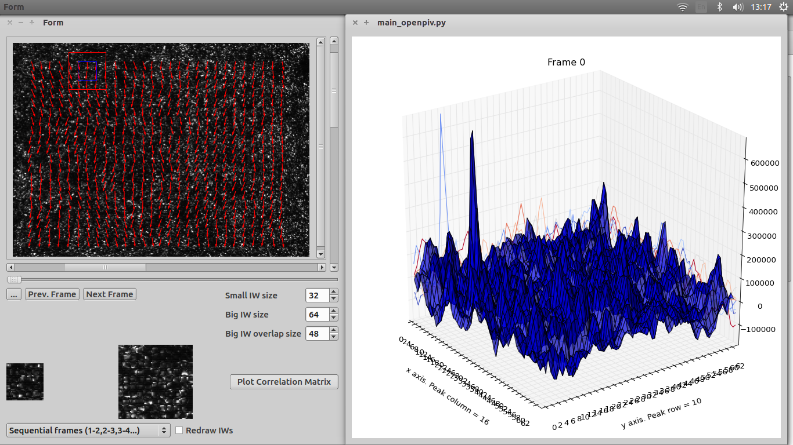

#piv-gui-pyhton
A python GUI for inspecting correlation matrices of Particle Image Velocimetry (PIV) analysis. This GUI currently uses correlation data format of OpenPIV (www.openpiv.net). The user is assumed to be familiar with pyhton OpenPIV.

##Warning
This GUI is still in the alpha stage - it's most likely buggy, and not all buttons are functional.

It's developed in Linux environment, but all the required dependencies are multi-platform (this GUI was tested on Linux/Mac/Win7.)

##Motivation
In essence, PIV relies on statistical "best match" approach, when estimating velocity vectors. While PIV is a well established method, outlier (incorrectly identified) vectors often show up in the calculated flow field. Inspecting correlation matrices can reveal the reason of an outlier vector. This GUI also enables the user to quickly change the Interogation Window size.

##Requirements
OpenPIV and its dependencies, as well as Qt, Sip, an PyQt.
Installation instruction for OpenPIV can be found here: http://openpiv.readthedocs.org/en/latest/src/installation_instruction.html
Installation instructions for Qt, Sip, and PyQt are widely available online, e.g. : http://doc.qt.io/qt-4.8/installation.html, http://pyqt.sourceforge.net/Docs/PyQt4/installation.html. QtDesigner (a GUI for creating Qt GUIs) was used to modify .ui files.


##Running
Once the repository is cloned, simply navigate to the folder where main_openpiv.py is and type 'python main_openpiv.py' in the terminal. This should hopefully start the GUI. Example data images are included in the repository. Below is a screenshot of the GUI in action. 

- The outer scrollbars are for moving IWs.Depending on your screen size, there might be 2 additional scroll bars appearing, so the whole image could be inspected. 
- Sliding bar,and Prev./Next Frame buttons moves to the next/previous frame.
- Load button is currently not functional. This could be functionalized for image loading.
- Small/Big IW/overlap size spin boxes set the sizes of the windows/overlap assuming square IWs. Press ENTER to confirm input.
- Small/Big Iw are currently set to be scaled to 64 *x* 64, and 128 *x* 128 pixel size before displaying.
- Combobox is currently not functional. The plan is to incorporate "on demand" vector plotting, for either paired or sequential images.
- Redaraw IWs checkbox to either redraw or fix IWs when switching between frames.
- Plot correlation matrix button calls a pop-up window, which display the correlation matrix. The correlation matrix is fully rotatable.
 
**NOTE:** Currently it is essential that the image size of the raw images and those of the flow field match, otherwise the IW bounding boxes will not be displayed in the proper position. Unfortunately, there seems to be no simple way to save a figure to exact pixel size. A workaround is to use the display DPI, see this [Stackoverflow question](http://stackoverflow.com/questions/13714454/specifying-and-saving-a-figure-with-exact-size-in-pixels) for example. 
In particular, one might find the bellow useful for modifying the openpiv.tool 'display_vector_field' function by appropriately adding the below:

```python
pl.axis('off')
q.axes.get_xaxis().set_visible(False)
q.axes.get_yaxis().set_visible(False)
fig.set_size_inches(float( width )/float( my_dpi ),float( height )/float( my_dpi ))
pl.savefig(new_file,interpolation = "none", bbox_inches='tight',pad_inches = 0)
pl.close()
```
One can check the DPI [here](http://www.infobyip.com/detectmonitordpi.php), but most likely it will need a few tries to get the exact value (it can be float).

##Editing the GUI

If you are interested in developing the *graphical* part of the GUI (the .ui file), QtDesigner is a relatively simple software created for that purpose (comes with Qt), with a good number of video tutorials, e.g. [QtDesigner Tutorial on Youtube](https://www.youtube.com/watch?v=GLqrzLIIW2E). Once the file is edited, it must be converted to .py file, using:

```python
pyuic4 input.ui -o output.py
```
**NOTE:** The converted .ui should not be modified, as any changes will be overwritten whenever the .ui file is edited and converted.

##Contributors

* Vytautas Zickus
* Jonathan Taylor


